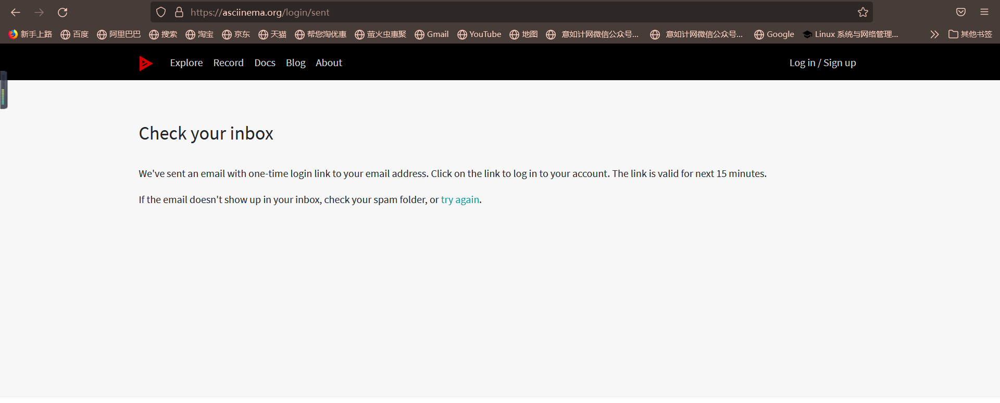
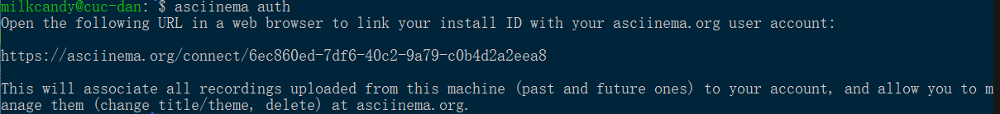
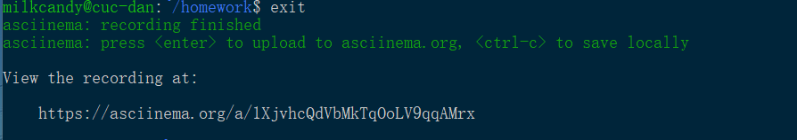
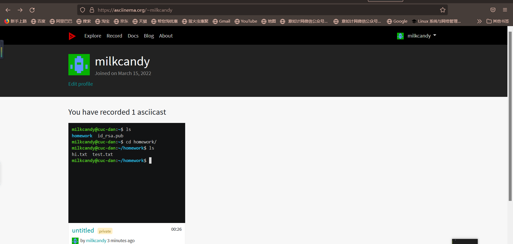
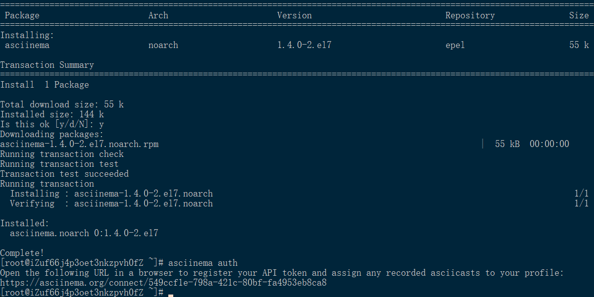
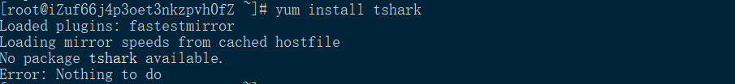
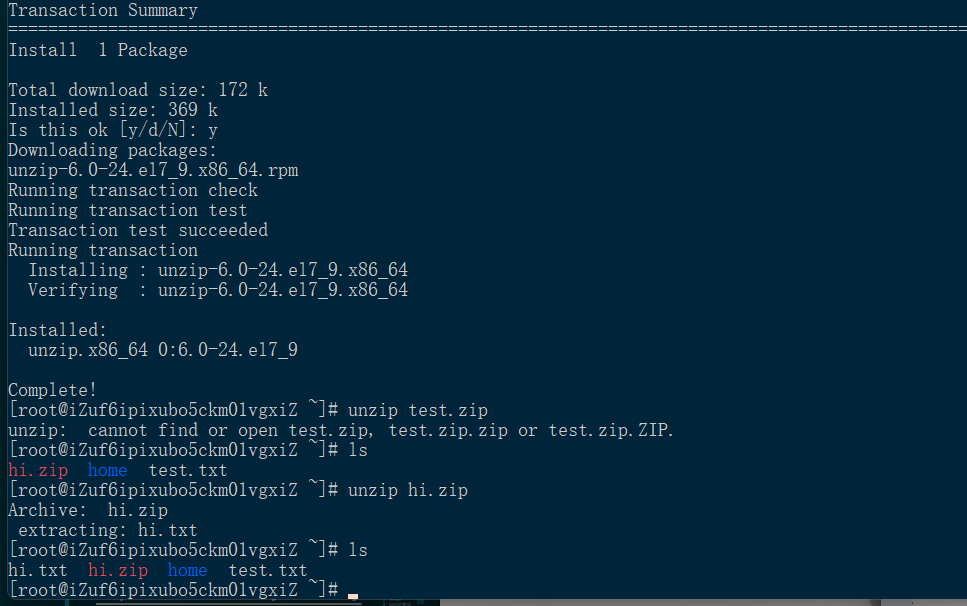

### linux实验作业二

完成人：2020212063037 莫丹亦佳

---
作业要求：
* 使用表格方式记录至少 2 个不同 Linux 发行版本上以下信息的获取方法，使用 asciinema 录屏方式「分段」记录相关信息的获取过程和结果
* 【软件包管理】在目标发行版上安装tmux和tshark；查看这两个软件被安装到那些路径；卸载tshark；验证tshark卸载结果
* 【文件管理】找到/tmp目录及其所有子目录下，文件名包含666的所有文件 | 找到/tmp目录及其所有子目录下，文件内容包含666的所有文件
```bash
cd /tmp && for i in $(seq 0 1024);do dir="test-$RANDOM";mkdir "$dir";echo "$RANDOM" > "$dir/$dir-$RANDOM";done
```
* 【文件压缩与解压缩】练习课件中文件压缩与解压缩一节所有提到的压缩与解压缩命令的使用方法
* 【子进程管理实验】
* 【硬件信息获取】目标系统的CPU、内存大小，硬盘数量与硬盘容量
---

####  一.asciinema的安装配置和账户关联
官网注册账号：https://asciinema.org


```bash
#升级软件包
~$ sudo apt update
#安装asciinema
~$ sudo apt install asciinema
#将asciinema录制的视频传到官网你的账号上,可以根据提示，打开链接，并且用邮箱登录自己注册的账号
~$ asciinema auth
```

```bash
#开始录制
~$ asciinema rec
```

```bash
#根据提示，exit和ctrl+D都可以退出,打开提示的链接，可以看到自己录制的视频
~$ exit
```



---
#### 二.实验环境Ubuntu20.04
* 【软件包管理】

安装 `tmux` 和 `tshark`
```bash

    ~$ sudo apt update
    ~$ sudo apt install tmux
    ~$ sudo apt install tshark
```
用 `find` 和 `which` 查找文件位置
```bash
    ~$ fing / -name "tmux"
    ~$ which tmux
    ~$ find / -name "tshark"
    ~$ which tshark
```
卸载 `tshark`
```bash
    ~$ dpkg -L tshark #查看和tshark相关联的文件
    ~$ dpkg -P tshark #将tshark的配置文件和执行文件删除
    ~$ dpkg -L tshark #再次检验
```

录屏地址：(点击可查看)
[](https://asciinema.org/a/477104)

* 【文件管理】

运行代码：
```bash
cd /tmp && for i in $(seq 0 1024);do dir="test-$RANDOM";mkdir "$dir";echo "$RANDOM" > "$dir/$dir-$RANDOM";done
```
查找 `/tmp` 目录及其所有子目录下，文件名包含 `666` 的所有文件：
```bash
~$ sudo find /tmp -name "*666"
```
查找 `/tmp` 目录及其所有子目录下，文件内容包含 `666` 的所有文件：
```bash
    #加上exclude参数配合通配符排除asciinema的输出文件
    ~$ sudo grep -r "666" /tmp --exclude=*.cast
```
录屏地址：
[](https://asciinema.org/a/477148)

* 【文件压缩与解压缩】

创建test.txt文档：
```bash
~$ vi test.txt
```

学会查看 `tldr` 帮助文档：
```bash
    ~$ tldr 7z
    ~$ tldr unzip
```
`7z` 压缩与解压缩：
```bash
~$ 7z a test.txt.7z test.txt
~$ rm test.txt
~$ 7z x test.txt.7z
```
`gzip` 压缩与解压缩：
```bash
~$ gzip test.txt
~$ gzip -d text.txt.gz
```
`bzip2` 压缩与解压缩：
```bash
~$ bzip2 test.txt
~$ bzip2 -d test.txt.bz2
```
`zip` 压缩与解压缩：
```bash
~$ sudo apt install zip
~$ zip test.txt.zip test.txt
~$ sudo apt install unzip
~$ unzip test.txt.zip
```
`tar` 压缩与解压缩：
```bash
~$ tar czf test.txt.tar.gz 
~$ rm test.txt
~$ tar xvf test.txt.tar.gz
```
`rar` 压缩与解压缩：
```bash
~$ rar a test.txt.rar test.txt
~$ rm test.txt
~$ rar x test.txt.rar
```
录屏地址：
[](https://asciinema.org/a/477421)
    
* 【子进程管理实验】
```bash
~$ ping www.baidu.com &
~$ CTRL-C
```
此时CTRL-C无效,以下“2连击”可以终止该ping进程:
```bash
~$ fg
~$ CTRL-C
```
把ping进程放到“后台”执行，把标准错误输出先重定向到标准输出，然后再把标准输出重定向到“黑洞”文件:
```bash
~$ ping www.baidu.com 1>/dev/null 2>&1 &
```
添加一个新的进程并且挂起：
```bash
~$ ping www.baidu.com 
~$ Ctrl+Z
```
查看进程,并杀死所有ping进程:
```bash
~$ ps aux | grep ping
~$ killall ping
```
发现被挂起的进程没有被杀死，用 `kill -9` 强制杀死
```bash
kill -9 [进程编号]
```

录屏地址：[](https://asciinema.org/a/478017)

* 【硬件信息获取】
```bash
#查看CPU
~$ cat /proc/cpuinfo
#查看内存大小
~$ cat /proc/meminfo | grep MemTotal
#查看硬盘数量与硬盘容量
~$ sudo fdisk -l | grep Disk
~$ df -l
```
录屏地址：[](https://asciinema.org/a/478039)

---

#### 三.实验环境阿里云虚拟机（centos)
```bash
yum install asciinema
```


* 【软件包管理】
```bash
~$ yum install tmux
yum install tshark
```
tshark不能安装

```bash
#查看支持安装tshark的包
~$ yum whatprovides tshark
~$ yum install wireshark
```
用find&which查找安装文件位置
```bash
~$ which tmux
~$ which tshark
~$ find / -name "tmux"
~$ find / -name "tshark"
```
卸载tshark
```bash
~$ yum remove wireshark
```
再次查看文件安装位置
```bash
~$ which tshark
```

录屏地址：[](https://asciinema.org/a/480109)

* 【文件管理】

运行代码：
```bash
cd /tmp && for i in $(seq 0 1024);do dir="test-$RANDOM";mkdir "$dir";echo "$RANDOM" > "$dir/$dir-$RANDOM";done
```
找到 `/tmp` 目录及其所有子目录下，文件名包含 `666` 的所有文件 
```bash
find /tmp -name "*666"
```
找到 `/tmp` 目录及其所有子目录下，文件内容包含 `666` 的所有文件
```bash
grep -r "666" /tmp --exclude=*.cast
```
录屏地址：[](https://asciinema.org/a/480116)

* 【文件压缩与解压缩】

创建文本文档:
```bash
vi hi.txt
```
`gzip`解压缩
```bash
gzip hi.txt
gzip -d hi.txt.gz
```
`zip` 解压缩
```bash
zip hi.zip hi.txt 
rm hi.txt 
yum install unzip 
unzip hi.zip 
```


录屏地址：
[](https://asciinema.org/a/480218)

* 【子进程管理实验】
```bash
~$ ping www.baidu.com &
~$ fg 
~$ CTRL+C
#ping进程放到后台
~$ ping www.baidu.com 1>/dev/null 2>&1 &
#查看进程
~$ ps aux | grep ping
#杀死所有进程
~$ killall ping
#强制关闭进程
~$ kill -9 ping
```

录屏地址：
[](https://asciinema.org/a/480232)

* 【硬件信息获取】
```bash
~$ cat /proc/cpuinfo #查看CPU
~$ cat /proc/meminfo | grep MemTotal #查看内存大小
~$ fdisk -l |grep Disk #查看硬盘数量与容量
~$ df -l
```
[](https://asciinema.org/a/480236)

##### 遇到问题

* 刚开始做文件管理的时候，没有注意到asciinema在录制的时候会写入文件，这样会导致输出文件的不可读，即出现乱码：
[](https://asciinema.org/a/477135)

查看了徐岩同学的讨论内容：
[畅课课后讨论](http://courses.cuc.edu.cn/course/82669/forum#/topics/224452?show_sidebar=false&scrollTo=topic-224452&pageIndex=2&pageCount=3&topicIds=230464,229102,228487,228229,228070,227158,225778,225676,224452,224041&predicate=lastUpdatedDate&reverse)

加上exclude参数配合通配符排除asciinema的输出文件,就可以解决问题了：
```bash
    
    ~$ sudo grep -r "666" /tmp --exclude=*.cast
```

----

##### 参考资料
asciinema auth：
https://zhuanlan.zhihu.com/p/56376724

dpkg指令：
https://www.cnblogs.com/TankXiao/p/3332457.html#removeN

阿里云虚拟机系统查看：
https://blog.csdn.net/qq_45848361/article/details/110359637
