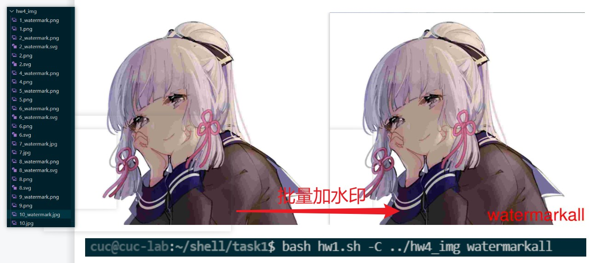

# chap0x04实验作业

-----
## 实验要求

任务一：用bash编写一个图片批处理脚本，实现以下功能：

*    支持命令行参数方式使用不同功能
    * 支持对指定目录下所有支持格式的图片文件进行批处理
    * 支持以下常见图片批处理功能的单独使用或组合使用
        * 支持对jpeg格式图片进行图片质量压缩
        * 支持对jpeg/png/svg格式图片在保持原始宽高比的前提下压缩分辨率
        * 支持对图片批量添加自定义文本水印
        * 支持批量重命名（统一添加文件名前缀或后缀，不影响原始文件扩展名）
        * 支持将png/svg图片统一转换为jpg格式图片
        
任务二：用bash编写一个文本批处理脚本，对以下附件分别进行批量处理完成相应的数据统计任务：

* 2014世界杯运动员数据
    * 统计不同年龄区间范围（20岁以下、[20-30]、30岁以上）的球员数量、百分比
    * 统计不同场上位置的球员数量、百分比
    * 名字最长的球员是谁？名字最短的球员是谁？
    * 年龄最大的球员是谁？年龄最小的球员是谁？

任务三：用bash编写一个文本批处理脚本，对以下附件分别进行批量处理完成相应的数据统计任务：

* Web服务器访问日志
    * 统计访问来源主机TOP 100和分别对应出现的总次数
    * 统计访问来源主机TOP 100 IP和分别对应出现的总次数
    * 统计最频繁被访问的URL TOP 100
    * 统计不同响应状态码的出现次数和对应百分比
    * 分别统计不同4XX状态码对应的TOP 10 URL和对应出现的总次数
    * 给定URL输出TOP 100访问来源主机

-------
## 实验环境
宿主机：win11
虚拟机：Ubuntu20.04

----
## 实验过程

### 任务一
安装`jpegoptim`
```bash
sudo apt install jpegoptim
```
安装`imagemagick`
```bash
sudo apt install imagemagick
```
任务一代码：

```bash
#!/bin/env bash

while getopts ":a:A:b:B:c:C:d:D:e:h:" opt 
do
    case $opt in
        a)
            #将获取的所有参数，储存在sub数组中,方便匹配处理
            sub=("$OPTARG") 
            until [[ $(eval "echo \${$OPTIND}") =~ ^-.* ]] || [ -z "$(eval "echo \${$OPTIND}")" ];
            do
                sub+=("$(eval "echo \${$OPTIND}")")
                OPTIND=$((OPTIND+1))
            done
            for Q in "${sub[@]}"
            do 
                jpegoptim -m30 "$Q"
            done
            ;;
        A)
            cd "$OPTARG" || exit
            for each in ./*.jpg
            do 
                jpegoptim -m30 "$each"
            done
            ;;
        b)
            #将获取的所有参数，储存在sub数组中,方便匹配处理
            sub=("$OPTARG") 
            until [[ $(eval "echo \${$OPTIND}") =~ ^-.* ]] || [ -z "$(eval "echo \${$OPTIND}")" ];
            do
                sub+=("$(eval "echo \${$OPTIND}")")
                OPTIND=$((OPTIND+1))
            done
            file=()
            for each in "${sub[@]}"
            do
                if [[ $each =~ % ]]
                then
                    percentage=$each
                else
                    file+=("$each")
                fi
            done
            for file in "${file[@]}"
            do
                convert "${file}" -resize "$percentage" "${file%.*}_resize.jpg" 
            done
        ;;
        B)
            cd "$OPTARG" || exit
            for each in ./*
            do 
                convert "${file}" -resize "${file%.*}_resize.jpg"
            done
            for each in ./*.png
            do 
                convert "${file}" -resize "${file%.*}_resize.jpg"
            done
            for each in ./*.svg
            do 
                convert "${file}" -resize "${file%.*}_resize.jpg"
            done
            ;;
        c)
            sub=("$OPTARG") 
            until [[ $(eval "echo \${$OPTIND}") =~ ^-.* ]] || [ -z "$(eval "echo \${$OPTIND}")" ];
            do
                sub+=("$(eval "echo \${$OPTIND}")")
                OPTIND=$((OPTIND+1))
            done 
            for each in "${sub[@]}"
            do 
                if [[ $each =~ .jpg ]] || [[ $each =~ .png ]] || [[ $each =~ .svg ]]
                then 
                    file+=("$each")
                else text="$each"
                fi
            done
            for file in "${file[@]}"
            do
                convert "${each}" -gravity southeast -fill red -pointsize 36 -draw "text 5,5 '$text'" "${each%.*}_watermark.jpg" 
            done
        ;;
        C)
            sub=("$OPTARG") 
            until [[ $(eval "echo \${$OPTIND}") =~ ^-.* ]] || [ -z "$(eval "echo \${$OPTIND}")" ];
            do
                sub+=("$(eval "echo \${$OPTIND}")")
                OPTIND=$((OPTIND+1))
            done 
            for each in "${sub[@]}"
            do 
                if [[ $each =~ .jpg ]] || [[ $each =~ .png ]] || [[ $each =~ .svg ]]
                then 
                    file+=("$each")
                else text="$each"
                fi
            done
            for each in ./*
            do 
                if [[ $each =~ .jpg ]]
                then 
                convert "${each}" -gravity southeast -fill red -pointsize 36 -draw "text 5,5 '$text'" "${each%.*}_watermark.jpg" 
                fi
                if [[ $each =~ .png ]]
                then
                convert "${each}" -gravity southeast -fill red -pointsize 36 -draw "text 5,5 '$text'" "${each%.*}_watermark.png" 
                fi
                if [[ $each =~ .svg ]]
                then
                convert "${each}" -gravity southeast -fill red -pointsize 36 -draw "text 5,5 '$text'" "${each%.*}_watermark.svg" 
                fi    
            done
        ;;
        d)
        sub=("$OPTARG") 
        until [[ $(eval "echo \${$OPTIND}") =~ ^-.* ]] || [ -z "$(eval "echo \${$OPTIND}")" ];
        do
            sub+=("$(eval "echo \${$OPTIND}")")
            OPTIND=$((OPTIND+1))
        done
        cd "${sub[0]}" || exit
        files=()
        preorsuf="${sub[1]}" #前后缀参数位置
        for each in "${sub[@]}"
        do
            if [[ $each =~ .jpg ]] || [[ $each =~ .png ]] || [[ $each =~ .svg ]]
            then
                files+=("$each")
            elif [[ "$each" =~ "pre" || "$each" =~ "suf" ]]
            then
                preorsuf+=("$each")
            fi
        done
        for each in "${files[@]}" #加前缀
        do 
            if [[ $preorsuf == "pre" ]]
            then
                if [[ $each =~ .jpg ]]
                then
                mv "${each}" "rename_${each:0-5}"
                # echo "${each}" 
                fi
                if [[ $each =~ .png ]]
                then
                mv "${each}" "rename_${each:0-5}"
                fi
                if [[ $each =~ .svg ]]
                then
                mv "${each}" "rename_${each:0-5}"
                fi
            fi
            if [[ $preorsuf == "suf" ]]
            then
                if [[ $each =~ .jpg ]]
                then
                mv "${each}" "${each%.*}_rename.jpg"
                # echo "${each}" 
                fi
                if [[ $each =~ .png ]]
                then
                mv "${each}" "${each%.*}_rename.png"
                fi
                if [[ $each =~ .svg ]]
                then
                mv "${each}" "${each%.*}_rename.svg"
                fi
            fi
        done
        ;;
        D)
        sub=("$OPTARG") 
        until [[ $(eval "echo \${$OPTIND}") =~ ^-.* ]] || [ -z "$(eval "echo \${$OPTIND}")" ];
        do
            sub+=("$(eval "echo \${$OPTIND}")")
            OPTIND=$((OPTIND+1))
        done
        cd "${sub[0]}" || exit
        preorsuf="${sub[1]}" #前后缀参数位置
        for each in ./*
        do
            if [[ $each =~ .jpg ]] || [[ $each =~ .png ]] || [[ $each =~ .svg ]]
            then
                files+=("$each")
            elif [[ "$each" =~ "pre" || "$each" =~ "suf" ]]
            then
                preorsuf+=("$each")
            fi
        done
        for each in "${files[@]}" #加前缀
        do 
            if [[ $preorsuf == "pre" ]]
            then
                if [[ $each =~ .jpg ]]
                then
                mv "${each}" "rename_${each:0-5}"
                # echo "${each}" 
                fi
                if [[ $each =~ .png ]]
                then
                mv "${each}" "rename_${each:0-5}"
                fi
                if [[ $each =~ .svg ]]
                then
                mv "${each}" "rename_${each:0-5}"
                fi
            fi
            if [[ $preorsuf == "suf" ]]
            then
                if [[ $each =~ .jpg ]]
                then
                mv "${each}" "${each%.*}_rename.jpg"
                # echo "${each}" 
                fi
                if [[ $each =~ .png ]]
                then
                mv "${each}" "${each%.*}_rename.png"
                fi
                if [[ $each =~ .svg ]]
                then
                mv "${each}" "${each%.*}_rename.svg"
                fi
            fi
        done
        ;;
        e)
        sub=("$OPTARG") 
        until [[ $(eval "echo \${$OPTIND}") =~ ^-.* ]] || [ -z "$(eval "echo \${$OPTIND}")" ];
        do
            sub+=("$(eval "echo \${$OPTIND}")")
            OPTIND=$((OPTIND+1))
        done
        cd "${sub[0]}" || exit
        for each in ./*
        do  
            if [[ $each =~ .png ]] || [[ $each =~ .svg ]]
            then
                convert "${each}" "${each%.*}.png"
            fi
        done
        ;;
        h | *)
        echo """
        Usage:
            bash test1.sh [operation] [argument(s)]

            operations:
            -a <file_name> [<file_name>] #compress specific jpgfile
            -A <path> #compress all files end with .jpg in specific path
            -b <file_name> [<file_name>] percentage%  #resize specific files with specific percentage
            -B <path> #resize all files end with .jpg,.png,.svg
            -c <file_name> [<file_name>] text #watermark specific files with specific text
            -C <path> <text> #watermark all files end with .jpg,.png,.svg
            -d <path> <option> <file_name> [<file_name>] #rename specific files
            -D <path> <option> #rename all files in the path
            -e <path> #change all .png/.svg files inte .jpg format
        """
    esac
done

```

#### 完成效果图
```option -a``` 效果:


```option -A``` 效果:


```option -b``` 效果:


```option -B``` 效果:


```option -c``` 效果:


```option -C``` 效果:



```option -d``` 效果:


```option -D``` 效果:


### 任务二

```bash
#!/bin/sh
#wget https://c4pr1c3.github.io/LinuxSysAdmin/exp/chap0x04/worldcupplayerinfo.tsv #download worldcupplayerinfo.tsv from the Internet

#awk统计不同年龄区间范围（20岁以下、[20-30]、30岁以上）的球员数量、百分比
awk ' 
BEGIN{
    FS="\t" #\t横向制表分割符
    lownum=0
    midnum=0
    highnum=0

    printf "%-10s %-6s %-10s \n","agerange","num","percentage"
}
{
if ($6>=0 && $6<20)
    lownum++;
else if ($6>=20 && $6<=30)
    midnum++;
else
    highnum++;
}
END{
    totalnum=lownum+midnum+highnum
    printf "%-10s %-6d %-2.1f%%\n","20岁以下",lownum,lownum*100/totalnum
    printf "%-10s %-6d %-2.1f%%\n","20到30岁",midnum,midnum*100/totalnum
    printf "%-10s %-6d %-2.1f%%\n","30岁以上",highnum,highnum*100/totalnum

}
' worldcupplayerinfo.tsv

```
#### 完成效果图


```bash

#统计不同场上位置的球员数量、百分比
awk '
BEGIN{
    FS="\t" #\t横向制表分割符
    Defendernum=0
    Dfenseurnum=0
    Forwardnum=0
    Goalienum=0
    Midfieldernum=0

    printf "%-10s %-6s %-10s \n","position","num","percentage"
}
{
if ($5 == "Defender")
    Defendernum++;
else if ($5 == "Défenseur")
    Dfenseurnum++;
else if ($5 == "Forward")
    Forwardnum++;
else if ($5 == "Goalie")
    Goalienum++;
else ($5 == "Midfielder")
    Midfieldernum++;
}
END{
    totalnum=Defendernum+Dfenseurnum+Forwardnum+Goalienum+Midfieldernum
    printf "%-10d\n",Defendernum
    printf "%-10d\n",Dfenseurnum
    
    printf "%-10s %-6d %-2.1f%%\n","Defender",Defendernum,Defendernum*100/totalnum
    printf "%-10s %-6d %-2.1f%%\n","Défenseur",Dfenseurnum,Dfenseurnum*100/totalnum
    printf "%-10s %-6d %-2.1f%%\n"," Forward", Forwardnum, Forwardnum*100/totalnum
    printf "%-10s %-6d %-2.1f%%\n","Goalie",Goalienum,Goalienum*100/totalnum
    printf "%-10s %-6d %-2.1f%%\n"," Midfielder", Midfieldernum, Midfieldernum*100/totalnum

}
' worldcupplayerinfo.tsv
```
#### 完成效果图


```bash

#名字最长的球员是谁？名字最短的球员是谁？
awk '
#名字最长
BEGIN{
    FS="\t" #\t横向制表分割符
}

!len || length($9) > len {len=length($9);name=$9} #通过length函数，找到最长的名字并且将最长的名字赋值给name

END{
    printf "the longest name is:"
    printf name
    printf "\n"
    printf len
    printf "\n"
}
' worldcupplayerinfo.tsv

awk '
#名字最短
BEGIN{
    FS="\t" #\t横向制表分割符
}

!len || length($9) < len {len=length($9);name=$9} #通过length函数，找到最短的名字并且将最短的名字赋值给name

END{
    printf "the longest name is:"
    printf name
    printf "\n"
    printf len
    printf "\n"
}
' worldcupplayerinfo.tsv
```
#### 完成效果图


```bash

#年龄最大的球员是谁？年龄最小的球员是谁？
# sed -i '$d' worldcupplayerinfo.tsv #预处理，去掉tag行重命名为worldcupplayerinfo_change.tsv，这个是去掉最后一行的写法
awk '  
#最大年龄
BEGIN{
    FS="\t" #\t横向制表分割符
    max=0
}
{
    if ($6 > max)
    max = $6
    # printf $6" "
}
END{
    printf "max_age:"
    printf max
    printf "\n"
}
' worldcupplayerinfo_change.tsv

awk '  
#最小年龄
BEGIN{
    FS="\t" #\t横向制表分割符
    min=100 #随便设置一个比较大的值
}
{
    if ($6 < min)
    min = $6
    #printf $6" "
}
END{
    printf "min_age:"
    printf min
    printf "\n"
}
' worldcupplayerinfo_change.tsv
```
#### 完成效果图


### 任务三
```bash
#!/bin/sh
# wget https://c4pr1c3.github.io/LinuxSysAdmin/exp/chap0x04/web_log.tsv.7z #从网上获取连接
# 7z x web_log.tsv.7z #解压
Function_1(){
    #统计访问来源主机top100和分别对应出现的总次数
    echo "----------#统计访问来源主机top100和分别对应出现的总次数----------"
    cat task3/web_log.tsv | awk '{print $1}' | sort | uniq -c |sort -n -r | head -n 100

}

Function_2(){
    #统计访问来源主机top100 IP和分别对应出现的总次数
    echo "----------统计访问来源主机top100 IP和分别对应出现的总次数----------"
    cat task3/web_log.tsv | awk '{print $1}' | grep -E '(^([1-9]|1[0-9]|1[1-9]{2}|2[0-4][0-9]|25[0-5])\.)(([0-9]{1,2}|1[1-9]{2}|2[0-4][0-9]|25[0-5])\.){2}([0-9]{1,2}|1[1-9]{2}|2[0-5][0-9]|25[0-4])$' | sort | uniq -c | sort -n -r | head -n 100 #网上查到的匹配IP地址的方法，用awk实现
    # cat task3/web_log.tsv | awk '{print $1}' | egrep "^([0-9]{1,3}\.){3}[0-9]{1,3}$" | sort | uniq -c | sort -n -r | head -n -100 #邱纪霖的方法，用cut实现

}


Function_3(){
    #统计访问来源主机URL top100和分别对应出现的总次数
    echo "----------统计访问来源主机URL top100和分别对应出现的总次数----------"
    cat task3/web_log.tsv | awk '{print $5}' | sort | uniq -c | sort -n -r | head -n 100 #用awk实现
    # cut -f5 task3/web_log.tsv | sort | uniq -c | sort -r -n | head -n 100 #邱纪霖的方法，用cut实现
}

    Function_4(){
        echo "----------统计不同响应状态码出现次数和对应的百分比----------"
        column=$(cat task3/web_log.tsv | grep "[0-9]" | awk '{print $6}' | sort | uniq -c | sort -n -r ) #grep "[0-9]"是为了排除column里response带有英文的这一数据
        type=()
        times=()
        couter=0
        flag=''
        # echo $column
        for each in $column
        do
            if [[ "$flag" ]] #在column的第一个数是次数，所以存在times里
            then 
                type+=("$each")
                flag=''
            else
                times+=("$each") #在column的第二个数是状态码，所以存在type里
                flag='a'          
            fi
        done
        # echo "$type"
        # echo "$times"
        for i in "${times[@]}" #累加得到总次数
        do
            let counter+=$i #let用来对整数进行运算
            # counter=$(expr $counter + "$i")
        done
        printf "%-12s %-18s %-12s \n" "状态码" "出现次数" "占比"
        for ((j=0;j<"${#type[@]}";j++))
        do
            percentage=$( echo "scale=5; ${times[j]} / $counter * 100" | bc ) #可以通过 scale设置结果的位数,ji即小数位精度，let和expr都不能处理浮点数运算，并且对不能控制结果的精度，可以使用bc命令来代替，bc一般跟着管道符|一起使用。
            printf "%-10s %-13d %-4.1f%%\n" "${type[j]}"  "${times[j]}" "${percentage}"
        done
    }
    

    Function_5(){
        echo "----------分别统计不同4xx状态码对应的top10 URL和对应出现的总次数----------"
        echo "403:"
        cat task3/web_log.tsv | awk '$6==403{print $5}' | sort | uniq -c | sort -n -r | head -n 10 #top10 URL
        echo "404:"
        cat task3/web_log.tsv | awk '$6==404{print $5}' | sort | uniq -c | sort -n -r | head -n 10 #response
    }
    

Function_6(){
    sub=("$OPTARG") 
    until [[ $(eval "echo \${$OPTIND}") =~ ^-.* ]] || [ -z "$(eval "echo \${$OPTIND}")" ];
    do
        sub+=("$(eval "echo \${$OPTIND}")")
        OPTIND=$((OPTIND+1))
    done
    echo "-------------正在统计该 URL 的 TOP 100 访问来源主机-------------"
    url="${sub[0]}"
    r=$( eval cat " task3/web_log.tsv | awk '\$5==\"$url\"{print \$1}' | sort | uniq -c | sort -n -r | head -n 100")
   
    # r=$(eval "awk '\$5==\"$url\"{print \$1}' task3/web_log.tsv | sort | uniq -c | sort -r -n | head -n 100")
    echo "$r"
}
while getopts :abcdef: opt
do
    case $opt in
    a)
        Function_1
    ;;
    b)
        Function_2
    ;;
    c)
        Function_3
    ;;
    d)
        Function_4
    ;;
    e)
        Function_5
    ;;
    f)
        Function_6
    ;;
    *)
    echo """
    
    --------------------------------------------------
    Usage:
        ./task3.sh [options] [argument]

        options:
            -a 统计访问来源主机 TOP 100 和分别对应出现的总次数
            -b 统计访问来源主机 TOP 100 IP 和分别对应出现的总次数
            -c 统计最频繁被访问的 URL TOP 100
            -d 统计不同响应状态码的出现次数和对应百分比
            -e 统计不同4XX状态码对应的TOP 10 URL和对应出现的总次数
            -f <url> 给定URL输出TOP 100访问来源主机
    """
    ;;
    esac
done
```

#### 完成效果图

```option -a``` 效果图:


```option -b``` 效果图:


```option -c``` 效果图:


```option -d``` 效果图:


```option -e``` 效果图:


```option -f``` 效果图:


----
## 参考资料
[vscode连接虚拟机](https://www.cnblogs.com/hi3254014978/p/12681594.html)
[shell脚本中的while getopts用法小结](https://www.cnblogs.com/kevingrace/p/11753294.html)

[shell脚本之处理用户输入](https://shixiangwang.github.io/home/cn/post/2017-08-19-working-with-user-input/)

[Shell字符串截取](http://c.biancheng.net/view/1120.html)

[shell利用imagemagick给图片添加水印](https://www.yuanchengzhushou.cn/article/8147.html)
[Find longest string and print it](https://www.unix.com/shell-programming-and-scripting/158248-find-longest-string-print.html)

特别感谢邱纪霖同学给我讲的一些知识点！！！在上方写了注释，方便以后理解:
[邱纪霖同学的github作业](https://github.com/CUCCS/2022-linux-public-807544076/tree/chap0x04/chap0x04)

[使用shell脚本统计文件中ip出现的次数](https://blog.csdn.net/xiamoyanyulrq/article/details/81570652)

[shell 正则匹配IP地址](http://t.zoukankan.com/yizhipanghu-p-13439629.html)
[怎么在shell中通过正则匹配ip地址](https://www.yisu.com/zixun/407889.html)
[shell使用for循环完成100以内累加](https://blog.51cto.com/jishuweiwang/1427233)
[linux下的bc命令可以设置结果的位数，通过 scale](https://blog.csdn.net/houzhizhen/article/details/80653347)
[linux shell中的eval命令](https://blog.csdn.net/damotiansheng/article/details/39735441)