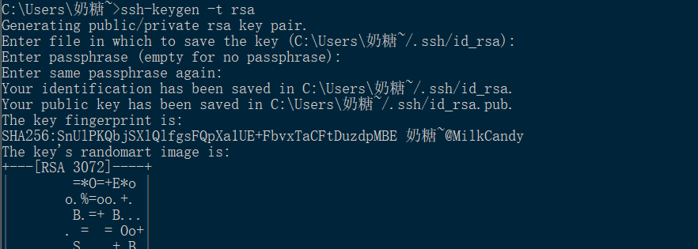

### Linux实验作业一
完成人：2020212063037 莫丹亦佳
***
#### 一.调查并记录实验环境的如下信息：
* 当前Linux发行版基本信息
```bash
#简约命令：

~$ cat /etc/issue

#详细命令：

~$ cat /etc/os-release
```


* 当前Linux内核版本信息
```bash
#方法一
~$ uname -a
#方法二
~$ cat /proc/version
```


---

#### 二.Virtualbox安装完Ubuntu之后新添加的网卡如何实现系统开机自启动和自动获取IP？

* 我们先观察所有的网卡以及正在工作的网卡，在这里可以看到它们的IPv4和IPv6地址,可以观察到新添加的网卡没有启用

```bash
#观察所有网卡
~$ ifconfig -a
#观察正在工作的网卡
~$ ifconfig
```


* 我们可以观察到新添加的enp0s9网卡并没有在工作，我们的目的是让新添加的网卡自启动，所以我们需要进入到/etc/netplan/目录下的网卡配置的文件里修改一个数据一般这个文件是以yaml为后缀

```bash
#sudo提高权限，使我们可以修改文档
~$ sudo vi 00-installer-config.yaml
#按i进入编辑模式，修改好后按Esc，：wq，就可以退出到终端
#我的编辑器有报一个错：‘modifiable is off’意思是可修改处于关闭状态,输入：set modifiable,成功解决问题
```
<table><tr><td bgcolor=beige><b style="color:red">划重点<b/> : <b style="color:black">一定要加sudo,否则会遇到各种权限不够的问题<b/></td></tr></table>

* 让我们来看看修改前和修改后的区别，添加了关于enp0s9的配置信息：


* 检查，再次启动，运用上面查看所有网卡（ifconfig -a），和正在工作的网卡(ifconfig )，发现新增网卡自启动成功

-------

#### 三.如何使用scp在[虚拟机和宿主机之间]、[本机和远程Linux系统之间]传输文件？
```bash
#补充一些可能会用到的查询路径的指令
~$ cd / #切换到根目录
~$ pwd #查看当前操作路径
~$ ls #查看当前路径下的文件
```
##### （1）虚拟机和宿主机之间双向传输


* 目的：将虚拟机上的test.txt文件传到宿主机上，虚拟机IP：192.168.56.103
```bash
#scp是secure copy的缩写，是用来进行远程文件拷贝的。
#数据传输使用ssh，并且和ssh使用相同的认证方式，提供相同的安全保证。
#所以只要是开通了ssh协议服务的主机，就可以用终端使用scp指令。
cmd > scp milkcandy@192.168.56.103:/home/milkcandy/homework/test.txt  ./
```


* 目的：将宿主机上的hi.txt文件传输到虚拟机上，虚拟机IP：192.168.56.101
```bash
cmd > scp /d:/homework_copy/hi.txt  cuc@192.168.56.101:/home/cuc/homework_copy
```


---

* 之所以将IP为192.168.56.103的主机改成了IP为192.168.56.101的主机是因为操作过程中出现了报错：permission denied

* 实验环境：Ubuntu20.04，IP：192.168.56.103
* 解决方法一：
查看第三章，发现是当前scp使用的[远程主机用户名]对于指定的[远程主机的绝对路径]没有[写入]权限。在上述报错图片来说，就是[milkcandy]用户对[/home/milkcandy/homework]没有写入文件的权限。
* 登录到目标主机上，检查/home/milkcandy/homework的权限位设定

```bash
~$ ls -ld /home/milkcandy/homework
~$ ls -ld /home/milkcandy
```

* 我们可以看到权限位都是drwxr-xr-x,其中前三个表示文件拥有者即给定IP主机用户的权限在这个例子里就是milkcandy，中间三个表示文件所属组拥有的权限，最后三个表示其他用户拥有的权限，由此可知:
milkcandy用户对/home/milkcandy有写入权限，
root对/home/milkcandy/homework有写入权限，
所以我们只需要更换目的路径为当前远程主机用户有权限写入的路径就行了

```bash
cmd > scp d:/homework_copy/hi.txt milkcandy@192.168.56.103:/home/milkcandy
```


* 解决方法二：
配置【root】用户的ssh公钥认证、免密登录
```bash
#首先要配置【root】的密码
~$ sudo passwd root
```


```bash
#更改普通用户关于ssh的配置，

~$ sudo vi /etc/ssh/sshd_config

#更改PermitRootLogin的参数prohibit-password为yes，并且要去掉前面的#注释符
```


退出vim编辑器,将之前scp传输到普通用户~/目录(/home/milkcandy)下的公钥追加到root用户

```bash
#进入root用户
~$ su 
#拷贝id_ssh.pub到root用户的authentic_keys里
~$ cat /home/milkcandy/.ssh/authentic_keys >> authentic_keys

#退出到普通用户
~$ exit
#重启一下ssh服务
~$ sudo systemctl restart ssh
#退出普通用户登录
~$ exit
#重新建立连接
~$ ssh root@192.168.56.103
#发现已经可以成功登录
```

```bash
#接下来试一试传输文件
cmd > scp d:/homework_copy/hi.txt root@192.168.56.103:/home/milkcandy/homework
```


##### （2）本机和远程Linux系统之间
一：以两台虚拟机为例：

* 本机IP：192.168.56.101

* 远程机IP：192.168.56.103

* 目的是将192.168.56.103机上的test.txt文件传输到192.168.56.101上
```bash
~$ scp milkcandy@192.168.56.103:/home/milkcandy/homework/test.txt  home/cuc/homework_copy
```


二：以本地机和阿里云试验机为例
* 先创建实验环境

* 将本地文件hi.txt传输到阿里云虚拟机里
```bash
cmd > scp d:/homework_copy/hi.txt root@101.133.156.81:~/homework
```


* 在阿里云虚拟机里查看


<table><tr><td bgcolor=beige><b style="color:red">scp用法总结 : <b style="color:black">语法：scp [可选参数] file_source  file_target，[可选参数]可以是 【 源文件/目录的路径 】 和 【目的文件/目录的路径 】，可以通过使用 本地路径 还是 远程ssh服务器上的路径 来区分是 【上传】，还是 【下载】
<b/>
以下为两种传输示例：

* 将本地文件传输到远程机上（上传）：
scp local_file  remote_username@remote_ip:remote_file
* 将远程机上的文件传输到本地机上（下载）：
scp remote_username@remote_ip:remote_file  local_file</td></tr></table>

-----

#### 如何配置SSH免密登录？

* 目的：主机A想要通过ssh免密登录到主机B（cuc@192.168.56.101），采用scp传输法
* 在主机A上生成rsa密钥对
```bash
cmd > ssh-keygen -t rsa
```

* 在主机A上用scp传输生成的公钥到主机B上
```bash
~$ scp .ssh/id_rsa.pub  cuc@192.168.56.101：~/home
```
* 切换到主机B上
```bash
#在目录~/.ssh下创建文件
~$ vi authorized_keys
~$ mkdir ~/.ssh/authorized_keys
#将在~/home下的id_rsa.pub拷贝到创建的~/.ssh目录下的authorized_keys文件里
cat ~/home/id_rsa.pub >> ~/.ssh/authorized_keys
```
* 重新在主机A上使用ssh连接主机B，成功免密登录


